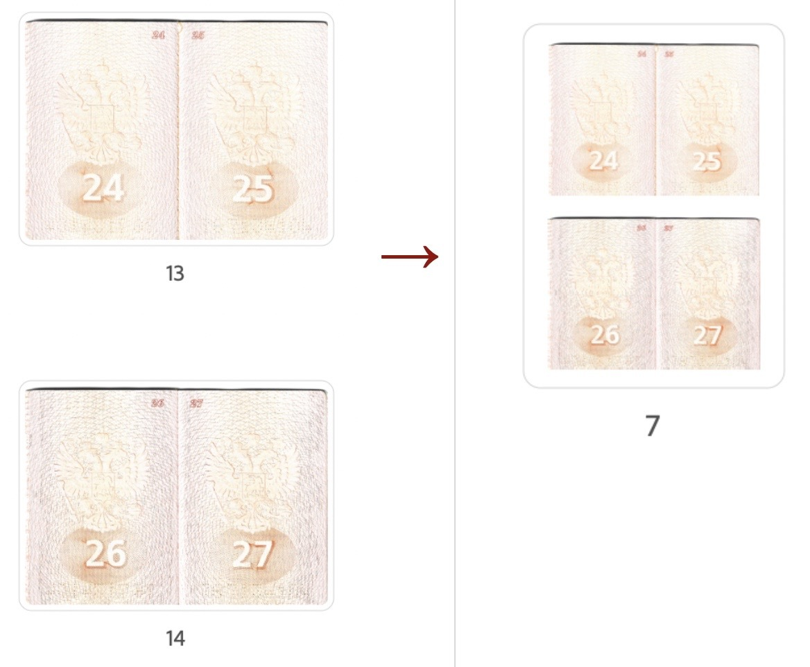
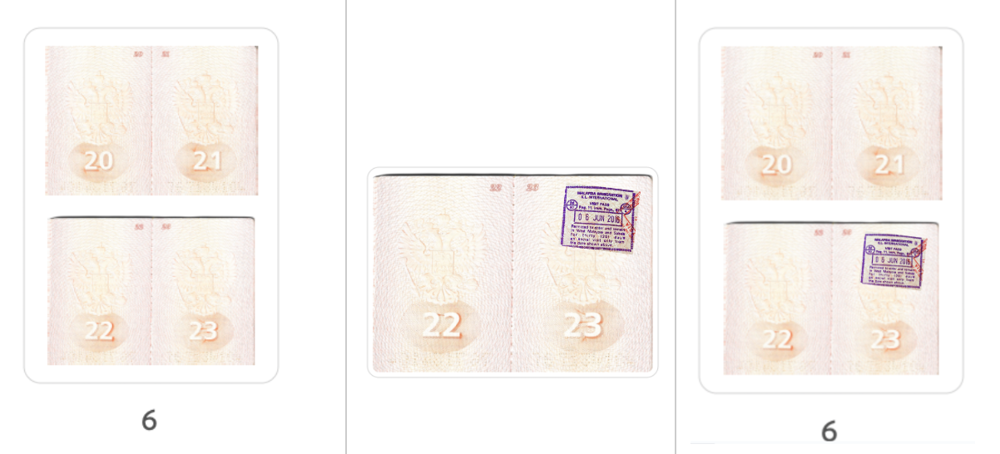

# Passport Scans Stitcher

Transforms scanned passport pdf with one image per page into pdf with two images per A4 page.



Any top/bottom page in a stitched passport can be replaced afterwards in case of having been changed.



## Install
Python 3.9 or higher is required. Clone the repository, and run the following command:

```bash
pip install -r requirements.txt
```

## Usage: creating stitched passport

Having passport scan in `path/to/scanned_passport.pdf` run:

```bash
python stitcher.py -i path/to/scanned_passport.pdf -o path/to/stitched_passport.pdf
```

## Usage: replacing a page in a stitched pdf
If you have a new stamp in your passport - replace one page instead of scanning/stitching the entire document.

```bash 
python stitcher.py \ 
  -i path/to/stitched_passport.pdf \
  -o path/to/renewed_stitched_passport.pdf \
  -r path/to/replacement_page.pdf \
  -p 24 --position bottom
```

